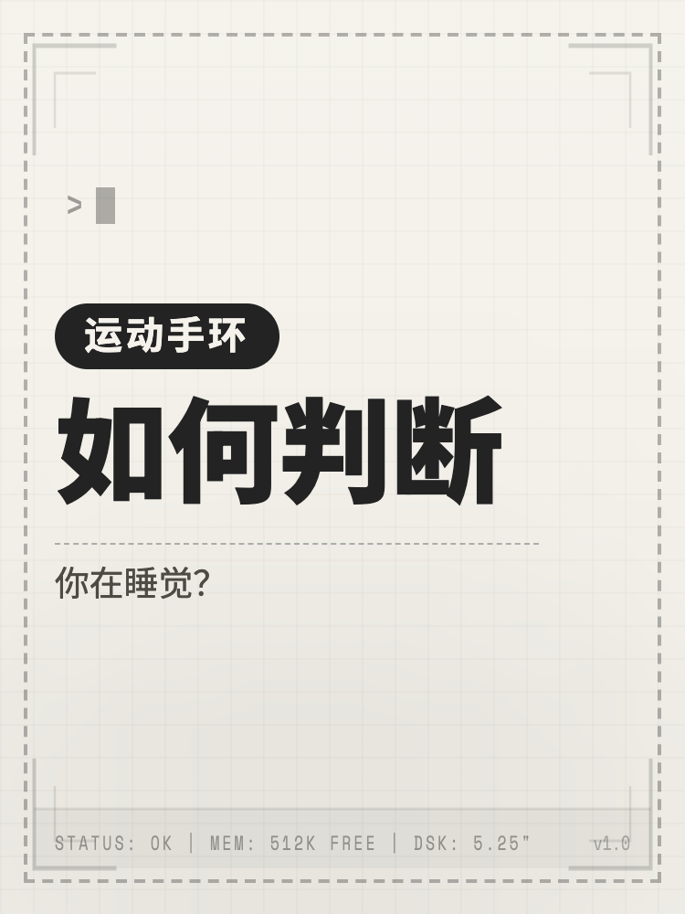
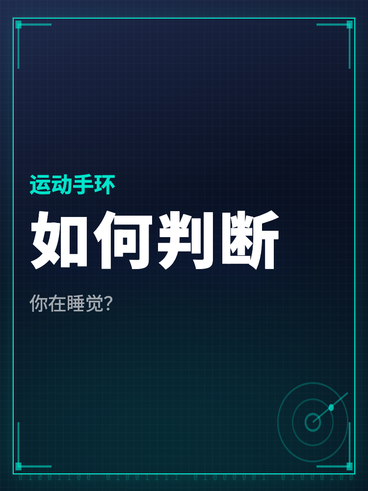

# 抖音封面生成器 · Cyber Cover Generator

<div align="center">

**一个高审美的抖音/短视频封面生成工具，支持多主题视觉系统，实时预览，一键导出。**

*Built with React 19 + TypeScript + Vite*

</div>

---

## 🖼️ 效果预览

<div align="center">

| Retro Terminal | Cyber Grid | Anthropic Editorial |
|:-:|:-:|:-:|
|  |  |  |

</div>

---

## ✨ 功能特性

### 🎨 四大主题视觉系统

每个主题切换后，**字体、配色、背景纹理、排版节奏、SVG 装饰元素**全套联动变化。

| 主题 | 风格定位 | 字体 |
|------|---------|------|
| **Cyber Grid** | 霓虹赛博科技风，HUD 瞄准框 + 雷达装饰 | Space Grotesk |
| **Anthropic Editorial** | 暖纸编辑美学，大引号 + 期刊排版 | Noto Serif SC |
| **Retro Terminal** | 复古终端风，ASCII 角框 + 状态栏 | Space Mono |
| **Mac Classic** | 早期个人电脑时代，System 6 窗口栏 + 迷你 Mac | Playfair Display |

### 📐 背景纹理

- **Cyber Grid 专属（15 种）**：标准网格 / 六角蜂窝 / 电路板 / 干涉波纹 / 菱形切割 / 数据流 / 等距轴测 / 放射扫描 / 密集微格 / 精细十字 + 更多
- **Anthropic 专属（4 种）**：纸纤维 / 亚麻肌理 / 柔雾 / 微粒噪点
- **Retro Terminal 专属（4 种）**：复古细网格 / 复古虚线 / 复古半调 / 纸纤维
- **Mac Classic 专属（4 种）**：纯净无纹 / 纸质颗粒 / 稿纸横线 / 精细点阵

### 🖊️ 文本系统

- **三行文本**独立输入：彩色小字（Line 1）/ 核心大标题（Line 2）/ 补充说明（Line 3）
- **逐行特效开关**：`边框`（圆角矩形 Tab）/ `Mark`（荧光笔高亮）/ `立体`（多层阴影）
- **字号微调滑块**：每行独立调节，Line 2 支持 20–140px

### 🖼️ 排版与画面

- **封面比例**：横屏 4:3 / 竖屏 3:4
- **排版风格**：左侧默认 / 居中聚焦 / 顶部引导 / 底部冲击 / 左中紧凑
- **画面边框开关**：可关闭最外层装饰边框
- **主题装饰开关**：可关闭 SVG 主题装饰元素

### 💾 导出

- `html-to-image` 转 PNG，像素比 2x，清晰度极高
- 文件名自动包含主题和配色信息

---

## 🚀 本地运行

**环境要求**: Node.js 18+

```bash
# 1. 安装依赖
npm install

# 2. 启动开发服务器
npm run dev
```

访问 `http://localhost:5173`

---

## 🌐 免费发布成网站

这个项目可以直接发布成静态网站，不需要后端，也不需要用户 `git clone` 到本地。

我已经按 GitHub Pages 的方式准备好了部署配置：

- 生产环境路径指向仓库子路径 `/cyber-cover-generator/`
- 推送到 `main` 后会自动触发 GitHub Actions 构建并部署

### GitHub Pages 开启方式

1. 打开仓库 `Settings`
2. 进入 `Pages`
3. `Source` 选择 `GitHub Actions`
4. 保持分支为 `main`，之后每次 push 都会自动更新网站

部署成功后，访问地址通常是：

`https://ique1116-rez.github.io/cyber-cover-generator/`

---

## 🛠️ 技术栈

| 技术 | 用途 |
|------|------|
| **React 19** | UI 框架 |
| **TypeScript** | 类型安全 |
| **Vite 6** | 构建工具 |
| **Tailwind CSS** | 控制面板样式 |
| **html-to-image** | 封面图像导出 |
| **lucide-react** | 图标库 |
| **Google Fonts** | 字体加载（Space Grotesk / Playfair Display / Space Mono / Noto Serif SC 等） |

---

## 📁 项目结构

```
cyber-cover-generator/
├── App.tsx                    # 全局状态中心，事件处理
├── types.ts                   # TypeScript 类型定义
├── constants.ts               # 主题/配色/背景/排版 全部配置
├── index.html                 # HTML 入口，字体引入
├── components/
│   ├── AppHeader.tsx          # 顶部标题
│   ├── ControlPanel.tsx       # 左侧控制面板
│   ├── PreviewCanvas.tsx      # 右侧实时预览（含 SVG 装饰渲染）
│   └── PromptHelper.tsx       # AI 提示词生成器
└── utils/
    ├── elements.ts            # 文本元素 CRUD 工具函数
    ├── prompt.ts              # AI Prompt 构建逻辑
    └── themeTemplate.ts       # 主题切换应用逻辑
```

---

## 🎯 设计原则

1. **主题是「封面视觉系统」**，而非应用 UI 皮肤。切换主题应整体联动：字体、配色、排版、装饰元素全部变化。
2. **文案永远用户自定义**，切换主题不覆盖用户输入的文字。
3. **Cyber Grid 是基线主题**，与其他主题完全解耦，后续新增主题不影响它。
4. **装饰不抢主角**：所有 SVG 装饰元素和背景纹理均采用极低透明度，只是「气氛烘托」，不遮挡文案。

---

---

<div align="center">

Made with ❤️ · Powered by React + Vite + Gemini

</div>
